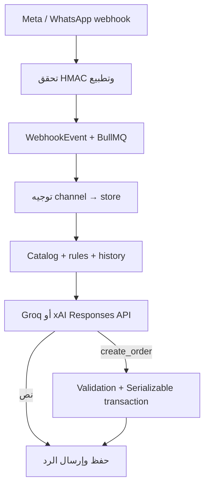

# AmiGo AI

منصة SaaS متعددة المستأجرين لأتمتة مبيعات المتاجر الجزائرية على Facebook وInstagram وWhatsApp باستعمال Groq مجاناً أو xAI/Grok اختيارياً، مع كتالوج ديناميكي، محادثات مستمرة، التقاط طلبيات مضبوط، ولوحة CRM عربية.

هذا المستودع تطبيق كامل قابل للتشغيل، وليس مثالاً مختصراً. يحتوي API وworkers وWhatsApp gateway وواجهة Next.js وقاعدة PostgreSQL وRedis وترحيلات production.

## ما تم بناؤه

- عزل المتاجر على مستويين: مفاتيح مركبة تحمل `storeId` وسياسات PostgreSQL Row-Level Security عبر مستخدم قاعدة بيانات محدود.
- OAuth حقيقي لـMeta: `state` موقّع وقابل للاستعمال مرة واحدة، تبديل authorization code، long-lived user token، اكتشاف الصفحات وحسابات Instagram، تشفير Page tokens، ثم الاشتراك في webhooks.
- endpoint موحّد لـFacebook وInstagram على `/api/webhooks/meta`، وendpoint لـWhatsApp Cloud على `/api/webhooks/whatsapp`، مع التحقق من `X-Hub-Signature-256` على الـraw body.
- WhatsApp بطريقتين: Cloud API الموصى بها، أو جلسات QR مستقلة عبر Baileys مع حفظ مفاتيح Signal مشفرة في PostgreSQL.
- حلقة خلفية مؤمّنة بـBullMQ: استقبال، تطبيع، توجيه للمتجر، حفظ idempotency event، سياق المحادثة، prompt ديناميكي، Responses API، function calling، حفظ الطلب، ثم إرسال الرد.
- حساب السعر والمخزون والتوصيل داخل الخادم فقط، داخل Serializable transaction؛ لا يُقبل السعر الذي يقترحه النموذج.
- لوحة Next.js/Tailwind لإدارة القنوات والمنتجات والمتغيرات والقواعد وأسعار 58 ولاية والطلبيات والشحن وCSV وGoogle Sheets.
- تكامل Yalidine، ومهايئ ZR Express قابل للضبط لأن عقد ZR/Procolis قد يختلف حسب حساب التاجر وإصدار منصته.
- تشفير AES-256-GCM للرموز والاعتمادات، Argon2id لكلمات السر، refresh-token rotation، صلاحيات RBAC، CSRF، rate limiting وsecurity headers.

## تنبيه أمني مهم

مفتاح API الذي أُرسل في المحادثة أصبح مكشوفاً؛ لا يوجد داخل الكود أو الحزمة. ألغِه من لوحة Groq وأنشئ مفتاحاً جديداً، ثم ضعه في `GROQ_API_KEY` داخل `.env` فقط. لا ترفع `.env` إلى Git.

## نشر مجاني على الإنترنت

[](https://render.com/deploy?repo=https://github.com/nouhissaad21-ops/amigo-ai)

لإطلاق MVP عام على Render مع Neon وGroq من دون فاتورة شهرية، اتبع [FREE_DEPLOYMENT.md](FREE_DEPLOYMENT.md). ملف `render.yaml` ينشئ خدمة الويب وKey Value، و`deploy/render/Dockerfile` يبني الموقع والـAPI والـworker داخل حاوية واحدة.

## تشغيل سريع بـDocker

المتطلبات: Docker Engine حديث وDocker Compose v2.

```bash
cp .env.example .env
openssl rand -base64 32   # CREDENTIAL_ENCRYPTION_KEY
openssl rand -hex 32      # JWT_SECRET
openssl rand -hex 32      # OAUTH_STATE_SECRET
openssl rand -hex 32      # META_VERIFY_TOKEN
```

عدّل `.env` وضع كلمات PostgreSQL قوية، مفتاح Groq الجديد، وإعدادات Meta. قيمة `CREDENTIAL_ENCRYPTION_KEY` يجب أن تفك إلى 32 byte بالضبط. بعدها:

```bash
docker compose up --build
```

خدمة `migrate` تطبق ترحيلات Prisma وRLS مرة واحدة، ثم يبدأ API والـworker وبوابة WhatsApp والواجهة. افتح `http://localhost:3000` وسجّل أول متجر. نقاط الصحة:

```text
GET http://localhost:4000/health/live
GET http://localhost:4000/health/ready
```

لإيقاف الخدمات دون حذف البيانات:

```bash
docker compose down
```

## تشغيل محلي بدون Docker للتطبيق

شغّل PostgreSQL 16 وRedis 7 محلياً، وأنشئ دوري قاعدة البيانات كما في `docker/postgres/01-roles.sh`، ثم:

```bash
npm install
cp .env.example .env
npm run db:deploy
npm run dev
```

يتطلب المشروع Node.js 22 أو أحدث وnpm 10 أو أحدث.

## إعداد Groq المجاني أو xAI/Grok

الإعداد الافتراضي يستعمل Groq Responses API المتوافق مع OpenAI، لأن مفاتيحه تبدأ بـ`gsk_` ويملك خطة مجانية محدودة:

```dotenv
AI_PROVIDER=groq
GROQ_API_KEY=your-new-groq-key
GROQ_BASE_URL=https://api.groq.com/openai/v1
GROQ_MODEL=llama-3.3-70b-versatile
```

لاستعمال Grok الحقيقي من xAI بدلاً منه:

```dotenv
AI_PROVIDER=xai
XAI_API_KEY=your-new-xai-key
XAI_BASE_URL=https://api.x.ai/v1
XAI_MODEL=grok-4.5
XAI_STORE_RESPONSES=false
```

Groq لا يدعم حفظ state داخل Responses API حالياً، لذلك يرسل التطبيق سجل المحادثة وسلسلة الأدوات في كل طلب. مع xAI، يعيد `XAI_STORE_RESPONSES=false` تمرير عناصر الاستجابة محلياً؛ وعند `true` يستعمل `previous_response_id`. تعريف `create_order` موجود في `apps/api/src/prompt.ts` والمعالجة في `apps/api/src/services/xai.ts`.

## إعداد Meta OAuth وWebhooks

1. أنشئ Meta Business App وأضف Facebook Login وMessenger وInstagram Messaging وWhatsApp عند الحاجة.
2. ضع رابط OAuth المطابق تماماً:

   ```text
   https://api.example.com/api/integrations/meta/callback
   ```

3. ضع callback الخاص بـFacebook وInstagram:

   ```text
   https://api.example.com/api/webhooks/meta
   ```

4. ضع callback الخاص بـWhatsApp Cloud:

   ```text
   https://api.example.com/api/webhooks/whatsapp
   ```

5. استعمل قيمة `META_VERIFY_TOKEN` نفسها في لوحة Meta، وفعّل حقول الرسائل اللازمة. في production يلزم HTTPS ومراجعة الصلاحيات المطلوبة من Meta حسب نوع التطبيق وحالة Business Verification.
6. من لوحة AmiGo اضغط **Meta OAuth**. الخادم يطلب الصلاحيات، يبدّل code إلى token طويل العمر، يجلب `me/accounts`، يحفظ Page access tokens مشفرة، ويربط كل `externalAccountId` بمتجر واحد فقط.

Meta Graph version قابل للتغيير عبر `META_GRAPH_VERSION`; اختبر إصدار Meta المستعمل قبل كل ترقية لأن الإصدارات والصلاحيات تتقاعد دورياً.

## WhatsApp متعدد الجلسات

### Cloud API — الموصى بها

من صفحة القنوات أدخل Permanent Access Token وPhone Number ID وWABA ID. كل رقم محفوظ كقناة تخص متجراً واحداً، والوارد يُوجّه بواسطة `phone_number_id`.

### QR / Baileys

زر **QR** ينشئ `Channel` و`WhatsAppSession` مستقلين، وينشر أمر بدء إلى بوابة WhatsApp. البوابة تولّد QR متغيراً، تحفظ credentials ومفاتيح Signal مشفرة لكل جلسة، وتعيد الاتصال تلقائياً. الجلسات لا تُحفظ في ملفات مشتركة.

Baileys يعتمد بروتوكول WhatsApp Web غير الرسمي وقد يتأثر بتغييرات أو سياسات WhatsApp؛ استعمل Cloud API للأحمال التجارية الحساسة، وراجع شروط Meta قبل تفعيله.

## Google Sheets وشركات الشحن

من **القواعد والتوصيل** يمكن حفظ connector credentials؛ لا تعاد المفاتيح إلى الواجهة بعد تخزينها.

- Google Sheets: انشر `docs/google-apps-script.gs` كتطبيق Web، ضع `AMIGO_SHEETS_SECRET` في Script Properties، ثم أدخل URL والسر نفسه في AmiGo. المزامنة upsert حسب رقم الطلب.
- Yalidine: أدخل API ID وAPI Token وولاية الإرسال. المهايئ يرسل الدفعة إلى `/parcels/` ويخزن request/response/tracking لأغراض التدقيق.
- ZR Express: أدخل Base URL وCreate Path والعقد المعطى لك من ZR/Procolis. المهايئ عام ومقصود أن يُضبط حسب وثائق حسابك؛ لا تفترض أن endpoint موحد لكل نسخ المنصة.

لا يمكن إرسال طلبية للشحن قبل `CONFIRMED` أو `PACKING`. سجل `ShippingDispatch` يمنع الإرسال المكرر، والنجاح ينقل الطلب إلى `SHIPPED`.

## دورة الرسالة



`provider + eventKey` فريد، وBullMQ job ID هو event ID، والرسالة الواردة/الصادرة مرتبطة بـ`sourceEventId`. إعادة Meta لنفس الحدث لا تنشئ طلباً ثانياً. الاتصال بمزوّد خارجي يبقى بطبيعته at-least-once عند timeout شبكي غامض، لذلك تتم متابعة الحالة والتتبع في قاعدة البيانات.

## أهم المسارات

```text
prisma/schema.prisma                         المخطط والعلاقات متعددة المستأجرين
prisma/migrations/                          إنشاء القاعدة وRLS والقيود
apps/api/src/routes/webhooks.ts             Meta وWhatsApp Cloud webhooks
apps/api/src/services/inbound.ts            الحلقة الخلفية الكاملة
apps/api/src/services/xai.ts                Groq/xAI Responses + function calling
render.yaml + deploy/render/                نشر MVP مجاني على Render
apps/api/src/services/orders.ts             السعر والمخزون والطلب والحالات
apps/api/src/services/baileys.ts             جلسات QR المشفرة
apps/api/src/services/shipping.ts            Sheets / Yalidine / ZR
apps/web/app/dashboard/                      لوحة التاجر
docs/ARCHITECTURE.md                         تفاصيل العزل والتدفقات
```

## الأوامر والتحقق

```bash
npm run db:generate
npm run typecheck
npm test
npm run build
npm run check
```

الاختبارات تغطي التشفير والتوقيع، صحة الهاتف والولاية، anti-hallucination prompt، مخطط الأداة، state machine، ومساري النص/function-call مع Responses API.

## قبل الإنتاج

- ضع API وWeb خلف reverse proxy/WAF مع TLS، واسمح لقاعدة البيانات وRedis من الشبكة الداخلية فقط.
- خزّن الأسرار في secret manager، وأعد تدوير المفاتيح دورياً. تغيير مفتاح AES يحتاج migration لإعادة تشفير الاعتمادات، فلا تستبدله مباشرة على بيانات حية.
- اضبط backup مشفراً لـPostgreSQL واختبر الاسترجاع، وراقب queue depth، failed jobs، webhook latency، أخطاء المزوّد وحدود/كلفة AI.
- ثبّت Meta App Review وBusiness Verification وData Deletion URL وسياسة الخصوصية قبل الإطلاق العام.
- افصل processes كما في Compose ووسّع الـworkers أفقياً. شغّل بوابة QR كخدمة واحدة أو أضف distributed session ownership قبل تكرار replicas.
- Baileys خيار تشغيلي إضافي وليس بديلاً تعاقدياً عن WhatsApp Cloud API.

تفاصيل التهديدات وتدوير الأسرار في `SECURITY.md`.
