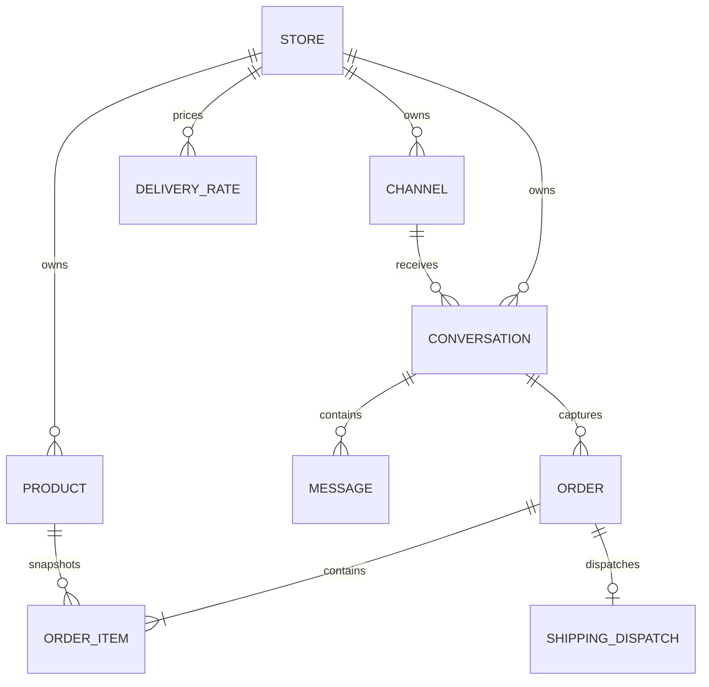

# هندسة AmiGo AI

## حدود الخدمات

| الخدمة             | المسؤولية                            | الصلاحية على البيانات                             |
| ------------------ | ------------------------------------ | ------------------------------------------------- |
| `web`              | Next.js dashboard وBFF rewrite       | لا تتصل بقاعدة البيانات                           |
| `api`              | Auth، CRUD، OAuth، webhooks          | system role للمسارات الموثقة، tenant role للوحة   |
| `worker`           | معالجة الرسائل وAI والطلبات          | system role لأنه يوجّه الحدث قبل معرفة المستأجر   |
| `whatsapp-gateway` | sockets مستقلة، QR، inbound/outbound | system role مع channel/session IDs                |
| `postgres`         | الحقيقة الدائمة والعزل               | `amigo_system` BYPASSRLS و`amigo_app` NOBYPASSRLS |
| `redis`            | BullMQ وOAuth nonce وcontrol pub/sub | بيانات مؤقتة؛ ليست مصدر الحقيقة                   |

## نموذج المستأجر

`Store` هو tenant root. كل سجل تجاري يحمل `storeId`، وتستعمل العلاقات الحساسة مراجع مركبة مثل `[storeId, channelId] → Channel[storeId, id]`. هذا يمنع ربط محادثة متجر بقناة متجر آخر حتى مع خطأ في application code.

`withTenant(storeId)` يفتح transaction على مستخدم `amigo_app` وينفّذ:

```sql
SELECT set_config('app.current_store_id', $1, true);
```

القيمة محلية للـtransaction. سياسات RLS تقارن `storeId` مع `app_private.current_store_id()`. عدم ضبط القيمة يعطي صفوفاً صفرية، وليس وصولاً عاماً. لا تستعمل tenant client خارج `withTenant`.

المسارات التي لا تعرف المستأجر بعد، مثل webhook routing وOAuth callback، تستعمل `amigo_system` ثم تفرض `storeId` صراحة في كل query. احتفظ بهذا الدور داخل الشبكة ولا تمنحه لطلبات المستخدم المباشرة.

## مخطط العلاقات الرئيسي



الجداول الأخرى: User/StoreMembership/Subscription، MerchantRules، ProductVariant، Lead، Connector، WhatsAppSession/AuthKey، WebhookEvent، RefreshSession وAuditLog.

## الوارد وIdempotency

1. Express يحتفظ بالـraw JSON على webhook routes.
2. `X-Hub-Signature-256` يُقارن بـHMAC-SHA256 مع Meta App Secret باستعمال timing-safe comparison.
3. `externalAccountId` للصفحة/IG أو Phone Number ID يحدد Channel ثم Store.
4. يُنشأ `WebhookEvent(provider,eventKey)` تحت unique constraint. فشل Redis بعد الحفظ يسبب HTTP 5xx؛ إعادة المزود تعثر على الحدث وتعيد queueing.
5. BullMQ يستعمل event UUID كـjob ID. worker يعمل claim ذرياً من `RECEIVED/FAILED` إلى `PROCESSING`.
6. unique constraints على inbound external message وعلى outbound `sourceEventId` تمنع تكرار السجل.
7. `Order(storeId,idempotencyKey)` يستعمل event ID، لذلك إعادة function call ترجع الطلب نفسه.

## تركيب prompt

لكل رسالة يركّب الخادم system prompt من:

- شخصية بائع بالدارجة الجزائرية البيضاء وقواعد عدم الاختلاق.
- MerchantRules وسياسة الاستبدال والعروض.
- المنتجات النشطة والمتغيرات والمخزون والسعر الفعلي.
- أسعار التوصيل المفعلة فقط.
- آخر 30 رسالة user/assistant.
- طلب حديث لنفس المحادثة لمنع التسجيل العرضي مرتين.

النموذج لا يستقبل أداة ذات حقول سعر. `create_order` ترسل هوية المنتج/الخيار والكمية وبيانات الزبون فقط. الخادم يعيد قراءة الكتالوج ويحجز المخزون ويحسِب subtotal والتوصيل والمجموع داخل `SERIALIZABLE` transaction، مع retry لتعارضات serialization.

## OAuth Meta

- البداية تتطلب ADMIN session.
- `state` هو JWT مدته 10 دقائق ويحمل user/store/nonce.
- nonce محفوظ في Redis ويُستهلك بـ`GETDEL`؛ replay مرفوض.
- code يُبدّل إلى short-lived token، ثم `fb_exchange_token` إلى long-lived user token.
- `me/accounts` يعيد Page tokens وحسابات Instagram Business.
- كل Page token يشفر بـAES-256-GCM مع IV عشوائي وauthentication tag.
- unique `(type, externalAccountId)` يمنع ربط نفس الحساب بمتجرين.

## WhatsApp QR ownership

كل Channel له WhatsAppSession واحدة، ومفاتيح Signal مفصولة بـ`sessionId/category/keyId`. `whatsapp-gateway` يحتفظ socket map في الذاكرة ويعيد bootstrap للجلسات من DB. عند scale-out يجب إضافة lease موزع، مثلاً Redis lock متجدد لكل channel، كي لا يمتلك replicaان socket نفسها.

## الطلب والمخزون

حالات الطلب المسموحة:

```text
CAPTURED → CONFIRMED → PACKING → SHIPPED → DELIVERED
    └──────────────→ CANCELED       └────→ RETURNED
```

الإلغاء قبل الشحن يعيد المخزون مرة واحدة مع compare-and-update على الحالة. snapshots في OrderItem تحفظ اسم المنتج وSKU والسعر وقت البيع حتى لو تغير الكتالوج لاحقاً.

## قرارات تشغيلية

- Redis يستخدم `noeviction` لأن إسقاط jobs أسوأ من رفض writes عند امتلاء الذاكرة.
- مهلة مزود AI مضبوطة، والـworker يعيد المحاولة exponential حتى خمس مرات ثم يرسل fallback محسوباً مرة واحدة.
- Groq يعيد سجل الحوار وسلسلة الأدوات في كل طلب. مع xAI، `XAI_STORE_RESPONSES=false` هو الوضع الأكثر تحفظاً للخصوصية.
- ShippingDispatch يخزن الطلب والاستجابة والخطأ. unique order dispatch يمنع الضغط المكرر على شركة الشحن.
- لا توجد secrets في logs أو API responses؛ connector listing يعيد metadata/config فقط.
